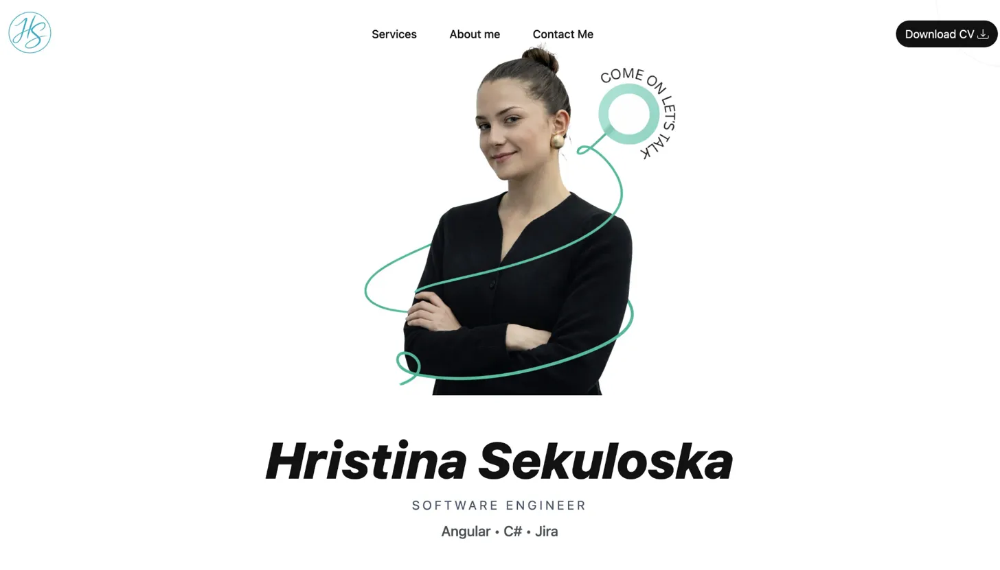

# Portfolio Website - Hristina Sekuloska

<div align="center">
  
  
  ### Software Engineer | Angular • C# • Jira
  
  [](https://portfolio-hristina.netlify.app/)
  [](https://www.linkedin.com/in/hristina-sekuloska/)
  [](https://github.com/Sekuloska)
  
</div>

---

## 🌟 About

A modern, responsive portfolio website showcasing my skills and services as a Software Engineer. Built with Angular and featuring a clean, professional design and an intuitive user experience.

### 🎯 Purpose

This portfolio serves as:
- **Skills demonstration** in Angular, C#, and modern web development
- **Contact platform** for project inquiries and opportunities
- **Personal brand** representation in the tech industry

---

## ✨ Features

### 🎨 Modern Design
- **Clean, minimalist aesthetic** with subtle gradients
- **Responsive design** that works beautifully on desktop, tablet, and mobile
- **Decorative elements** including curved lines and geometric shapes

### 📱 Sections

#### 🏠 Hero Section
- Eye-catching introduction with professional portrait
- Animated decorative elements
- Clear call-to-action with "COME ON LET'S TALK" feature
- Technology stack showcase: Angular • C# • Jira

#### 💼 Services Section
Three service offerings presented in beautiful card layouts:
1. **Angular Development**

2. **C# / .NET Development**

3. **Jira Development**

#### 📞 Contact Section
- Large, friendly call-to-action button with pre-filled email
- Direct links to LinkedIn, GitHub, and email

---

## 🛠️ Technologies

### Frontend


### Tools & Workflow


## 📁 Project Structure
```
portfolio-website/
├── src/
│   ├── app/
│   │   ├── components/
│   │   │   └── navbar/           # Navigation component
│   │   ├── sections/
│   │   │   ├── hero/             # Hero section
│   │   │   ├── services/         # Services showcase
│   │   │   └── contact/          # Contact section
│   │   ├── app.component.*       # Root component
│   │   └── app.routes.ts         # Routing configuration
│   ├── assets/
│   │   ├── images/
│   │   │   ├── icons/            # Tech logos (Angular, C#, Jira, etc.)
│   │   │   └── portrait.png      # Profile photo
│   │   └── documents/
│   │       └── cv.pdf            # Downloadable CV
│   ├── styles/
│   │   ├── _variables.scss       # SCSS variables
│   │   ├── _mixins.scss          # Reusable SCSS mixins
│   │   └── styles.scss           # Global styles
│   └── index.html                # Entry point
├── angular.json                  # Angular configuration
├── package.json                  # Dependencies
└── README.md                     # This file
```
